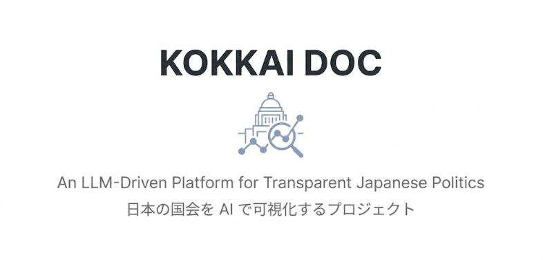
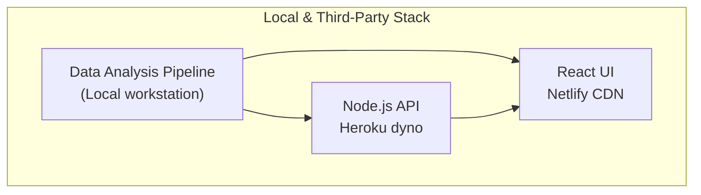
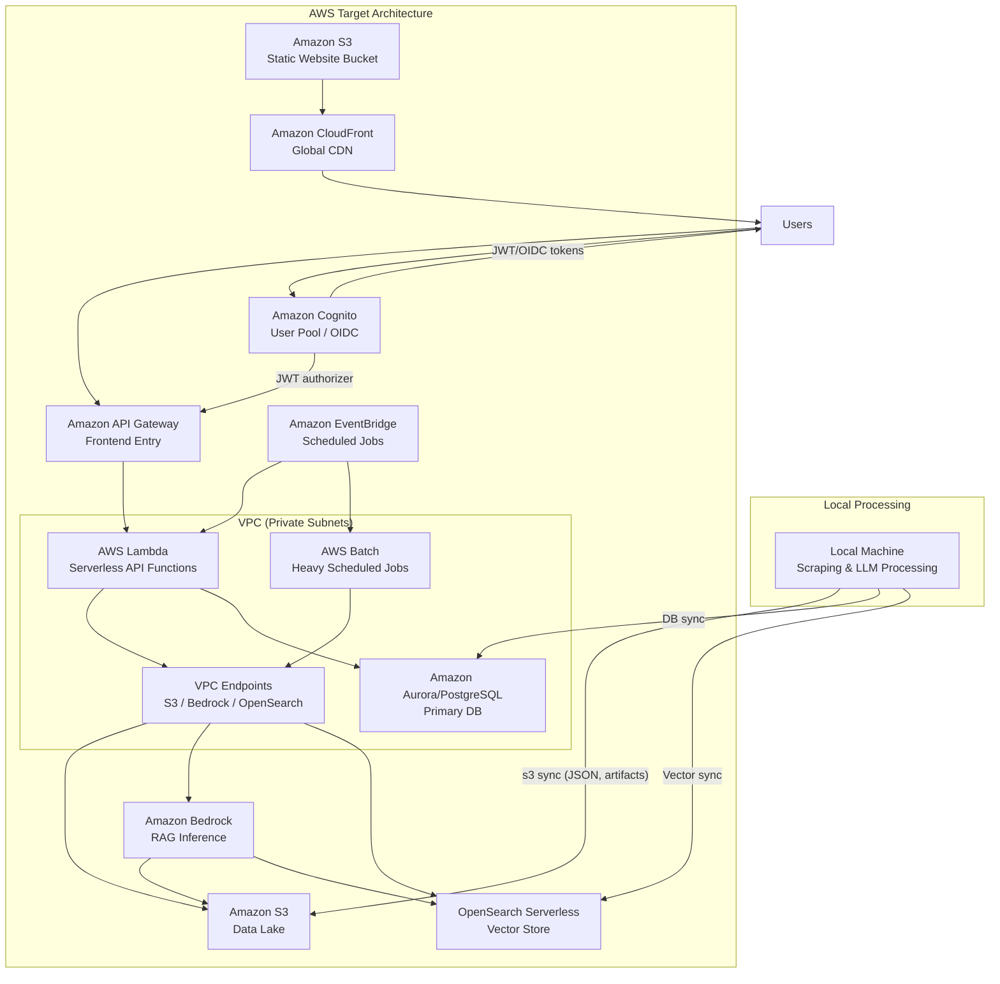

# 🌏 KOKKAI DOC — An LLM-Driven Platform for Transparent Japanese Politics



# 🇯🇵 KOKKAI DOC — 日本の国会を AI で可視化するプロジェクト

KOKKAI DOC is a large-scale civic-tech project that analyzes **all Japanese parliamentary speeches** using **LLMs**, computes issue-specific political stances, and makes them accessible through a fully interactive public platform.
👉 **[https://kokkaidoc.com](https://kokkaidoc.com)**

KOKKAI DOC は、日本の国会議員によるすべての国会発言を **大規模言語モデル（LLM）** で解析し、テーマ別の政治的スタンスを数値化・可視化する市民テクノロジープロジェクトです。
👉 **[https://kokkaidoc.com](https://kokkaidoc.com)**

This project integrates **computational political science**, **LLM-based text analysis**, **semantic embeddings**, and **modern cloud architecture** to improve political transparency in Japan.
本プロジェクトは、**計量政治学**・**LLM によるテキスト分析**・**埋め込み空間の構築**・**クラウド基盤**を統合し、日本政治の透明性向上を目的としています。

---

# 📣 Media Coverage

# 📣 メディア掲載

- 📘 **arXiv (2025)** — _KOKKAI DOC: An LLM-driven framework for scaling parliamentary representatives_
  [https://arxiv.org/abs/2505.07118]（アップロード済論文）
- 📝 Note.com — [https://note.com/yo4shi80/n/n000c987b5a3b](https://note.com/yo4shi80/n/n000c987b5a3b)
- 📰 ABEMA Times — [https://times.abema.tv/articles/-/10179655](https://times.abema.tv/articles/-/10179655)
- 🧪 Techno-Edge — [https://www.techno-edge.net/article/2025/05/19/4367.html](https://www.techno-edge.net/article/2025/05/19/4367.html)

---

# ✨ What is KOKKAI DOC?

# ✨ KOKKAI DOC とは？

KOKKAI DOC is a **public-facing political analysis platform** that fully automates the extraction, summarization, embedding, and visualization of parliamentary stances.

KOKKAI DOC は、国会発言の収集・要約・埋め込み・可視化を完全自動化する **政治分析プラットフォーム** です。

---

## 🗳️ 1. Parsing All Parliamentary Speeches

## 🗳️ 1. 国会発言データの大規模収集

- 2000 年〜現在の衆参すべての発言を取得
- 防衛・原発・経済・少子化・気候など、テーマ別に抽出
- Fine-tuned BERT によって **30 万件以上の意見文を分類**

Using National Diet Library API + custom scrapers, KOKKAI DOC collects topic-relevant segments and extracts >300k opinion sentences.

---

## 🤖 2. LLM-Based Summarization

## 🤖 2. LLM（GPT-4o-mini）による意見要約

Every opinion-based sentence is summarized by GPT-4o-mini:

- clean, consistent stance statements
- dramatic reduction in linguistic noise
- embedding quality significantly improved

各意見文を GPT-4o-mini が短く一貫した形式に要約し、埋め込み品質を大幅に向上させます。

---

## 🧭 3. Automatic Extraction of Political Axes

## 🧭 3. 「政治的対立軸」の自動抽出

GPT-4o-mini automatically:

- identifies latent **issue-specific axes**
- generates pro/con reference summaries
- removes human bias from axis selection

GPT-4o-mini が stance summaries から **潜在的な対立軸を自動抽出** し、賛否の参照文を生成します。

---

## 📈 4. Embedding Politicians in Semantic Space

## 📈 4. 議員を埋め込み空間にマッピング

Using SBERT embeddings:

- UMAP ideological maps
- violin plots showing stance distributions
- clustering of political blocs (e.g., LDP–Komeito vs JCP–CDP)

SBERT による埋め込みを UMAP で可視化し、政党間の位置関係・クラスタリングを確認できます。

---

## 🕰 5. Diachronic (2000–2024) Analysis

## 🕰 5. 政党の時系列分析（2000〜2024）

The platform measures **how party positions shift across 20+ years**, revealing:

- LDP, JCP, Komeito の長期変動
- 原発・安保・少子化などの政策変遷
- 政策イベント前後の動き

20 年以上の発言データを平均化し、政党のスタンスの変化を可視化します。

---

# 🌐 What the Website Shows

# 🌐 Web サイトで見られるもの

### 1. Representative Profiles

### 1. 議員ページ

- テーマ別スタンススコア
- 発言の LLM 要約
- UMAP 位置図
- 他議員との比較
- 時系列推移

### 2. Issue Visualizations

### 2. 政治テーマごとの可視化

- 自動抽出された賛否軸
- 議員分布の可視化
- イデオロギー参照点（LLM 生成）

### 3. LLM Topic Summaries

### 3. LLM による要点要約

### 4. Party-Level Time Series

### 4. 政党の時系列推移

### 5. Public API

### 5. 公開 API

- representatives
- speeches
- committees
- stance vectors
- manifesto consistency checking
  議員データ／発言／スタンスなどを API で提供。

---

# 📄 About the Research Paper

# 📄 論文について

**Paper:** _KOKKAI DOC: An LLM-driven framework for scaling parliamentary representatives_
**Authors:** Ken Kato & Christopher Cochrane
**PDF:** [https://arxiv.org/abs/2505.07118]

### Key Innovations

### 主要な貢献点

1. **LLM summarization for de-noising speeches**
   → 埋め込みの精度を大幅向上
2. **Automatic extraction of controversy axes**
   → 人間の恣意性を排除
3. **Diachronic ideological analysis (2000–2024)**
   → 日本政治の長期変動を LLM で初めて分析

The method achieves high agreement with expert evaluations.
専門家推定とも高い一致を示します。

---

# 🏗️ Architecture Overview

# 🏗️ アーキテクチャ

## Current Deployment (Legacy)

## 現行（レガシー）構成



## Target AWS Architecture

## 目標とする AWS 構成



- Local machine runs scraping/LLM processing, then `s3 sync` pushes raw JSON and derived artifacts to the S3 data lake.
- EventBridge can trigger AWS Batch for heavyweight scheduled jobs; outputs land in the S3 data lake for downstream APIs.
- Lambda can call Amazon Bedrock for RAG-style responses, retrieving context from the S3 data lake and OpenSearch vector store.
- Frontend requests hit API Gateway, which invokes Lambda functions to serve data from S3, Aurora/PostgreSQL, and OpenSearch.
- The same job syncs processed tables into Aurora/PostgreSQL and embeddings into OpenSearch so the serverless API and site stay current.
- Network boundaries: Lambda and Batch run in private subnets inside a VPC with endpoints to S3/Bedrock/OpenSearch; only CloudFront and API Gateway are public.

### Identity & Auth (recommended)

- Amazon Cognito User Pools (or an external OIDC provider) issues JWTs for signed-in users.
- CloudFront forwards authenticated requests to API Gateway, which uses a JWT authorizer to validate tokens before invoking Lambda.
- Lambda enforces fine-grained access (e.g., per-tenant or per-feature) and reads secrets from Secrets Manager/SSM instead of env vars.
- Public assets stay cacheable on CloudFront/S3; API paths remain protected via Gateway authorizers.

---

# 📁 Repository Structure

# 📁 リポジトリ構成

```
.
├── api/            # Express.js backend
├── frontend/       # React SPA
├── data/           # LLM pipeline, scraping, embeddings
├── infra/          # AWS CDK (S3 + CloudFront)
├── memo/           # Notes
└── .github/workflows/ # CI/CD
```

---

# 🚀 Progress Highlights

# 🚀 これまでの成果

- ✔️ 30 万件以上の国会発言の収集
- ✔️ 日本語 BERT 分類器の構築
- ✔️ GPT-4o-mini によるスタンス要約
- ✔️ 政治的対立軸の自動抽出
- ✔️ UMAP 可視化・埋め込みベース分析
- ✔️ 時系列分析（2000–2024）
- ✔️ arXiv 論文公開
- ✔️ 国内主要メディアで多数掲載

---

# 🎯 Vision

# 🎯 ビジョン

KOKKAI DOC aims to:

- reduce information asymmetry in Japanese politics
- empower voters with empirical insights
- provide robust tools for journalists and researchers
- apply AI to real-world democratic processes

KOKKAI DOC は以下を目指します：

- 日本政治の「情報の非対称性」をなくす
- 有権者がよりよい判断をできる環境を作る
- 研究者・メディアに強力なデータ基盤を提供
- AI を民主主義のアップデートに役立てる
