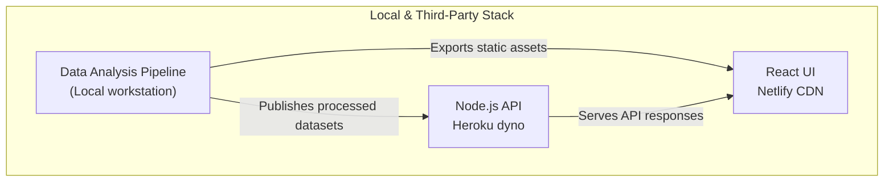
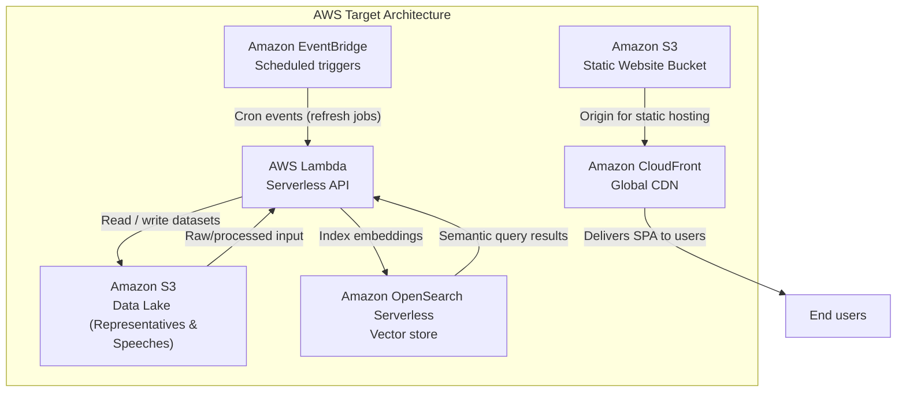

# About this project

In this project I am exploring how I can enhance the transparency of Japanese politics further by collecting the data related to the voting patterns of the politicians as well as visualizing these voting patterns. You can see the demo video on youtube [here.](https://youtu.be/6PBbP3SSkhA)

## Current deployment

## Future cloud configuration

## Progress so far

- Scraped the voting patters of the different parties using selenium from the Sangiin website.(<https://www.sangiin.go.jp/japanese/touhyoulist/touhyoulist.html/>)

- Fetched the arguments of the parties(討論) from the api provided by the National Diet Library.(<https://kokkai.ndl.go.jp/api.html/>)

- Created an API hosting the above information and deployed it on heroku.
- Created a frontend displaying the collected data and deployed it on the web.

## Code structure

- `api/` – Express backend that serves the scraped and processed Diet data.
- `frontend/` – React (Create React App) frontend that visualizes the datasets.
- `infra/` – AWS CDK application defining infrastructure for hosting the frontend (S3 + CloudFront).
- `data/` – Supporting datasets, scripts, and notebooks used during scraping and analysis.
- `memo/` – Research notes and experiments related to the domain.
- `.github/workflows/` – Automation definitions (CI/CD) for the repository.

## Infrastructure

The CDK app under `infra/` currently provisions:

- Versioned, private S3 bucket (`FrontendBucket`) for static frontend assets.
- CloudFront distribution (`FrontendDistribution`) with HTTPS enforcement, caching, and SPA-friendly error rewrites.
- Optional logging S3 bucket and CloudFront invalidation outputs for integrations.

Stack outputs expose the bucket name, distribution domain, and distribution ID to streamline uploads and cache invalidations.

## Automation

GitHub Actions workflows:

- `deploy-frontend.yml` – Builds the React app on pushes to `main` (or manual trigger), syncs the compiled assets to the CDK-managed S3 bucket, and invalidates the CloudFront distribution to roll out updates.
