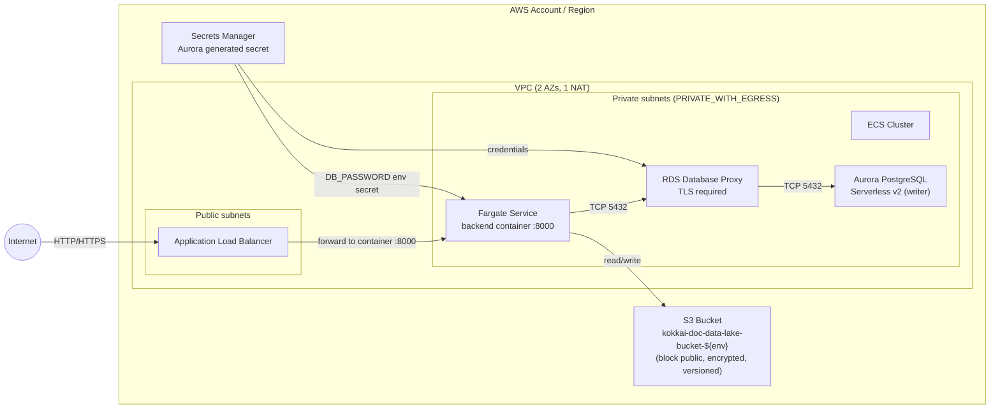

## Infrastructure (AWS CDK)

This directory contains the AWS CDK app that deploys Kokkai Analysis infrastructure. For branch/environment deployment behavior, see `DEPLOYMENT.md`.

### Stacks

- **`BackendStack-{environment}`** (`infra/lib/stacks/backend-stack.ts`)
  - **Networking**: A new VPC (`maxAzs: 2`, `natGateways: 1`)
  - **Compute**: ECS Cluster + **Application Load Balanced Fargate Service**
    - Container image built from the repo’s `backend/` directory (Docker asset) and run on Fargate
    - Container port: **8000**
  - **Database**: Aurora PostgreSQL Serverless v2 cluster + **RDS Database Proxy**
    - Proxy requires TLS; credentials sourced from the cluster’s generated secret
  - **Storage**: S3 “data lake” bucket: `kokkai-doc-data-lake-bucket-${environment}`
    - Block public access, S3-managed encryption, versioning enabled
  - **IAM**: Fargate task role has read/write access to the bucket
  - **Outputs**: ALB DNS name, DB proxy endpoint

### Architecture diagram (BackendStack)



### How the backend container image is built

`BackendStack` uses `ecs.ContainerImage.fromAsset(...)`, which means:

- The **Docker image is built at `cdk deploy` time** (locally or in CI)
- CDK publishes it to an **ECR asset repository**
- Fargate **pulls the image from ECR** at runtime (it does not read your local `backend/` folder)

### Deploying locally (manual)

From the repo root:

```bash
cd infra
npm ci
npx cdk synth --context environment=dev
npx cdk deploy --all --context environment=dev
```

Environment selection:

- `--context environment=dev|staging|prod`, or
- `CDK_ENVIRONMENT=dev|staging|prod`


